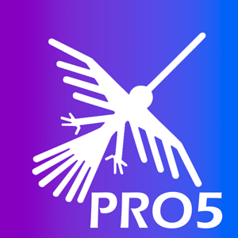

<<<<<<< HEAD


# **Facturador PRO 6**


## Términos y condiciones del uso de este repositorio

1.- Este repositorio es de código abierto pero de acceso privado, se permite la distribución y/o modificaciones si se hace referencio a la casa matriz del desarrollo de este es software es [https://facturaloperu.com](https://facturaloperu.com)

2.- Esta sección de términos y condiciones no puede ser removida al compartir o distribuir el repositorio de alguna forma, de hacerlo, [https://facturaloperu.com](https://facturaloperu.com) se reserva el derecho de remover el acceso y limitar el uso a quien lo distribuya de esa forma o a quien se atribuya el desarrollo del mismo.

3.- Si desea distribuir el código fuente como propio, debe tener al menos un 30% de modificaciones en todo el código, y previamente debe validarse dicho % por [https://facturaloperu.com](https://facturaloperu.com)

4.- El uso del software a nivel funcional es marca blanca, sin embargo a nivel de distribución del código fuente, debe contener esta sección de términos y condiciones.

5.- [https://facturaloperu.com](https://facturaloperu.com) no se hace responsable por los daños o perjuicios del uso del código de este software cuando no ha sido distribuido directamente por [https://facturaloperu.com](https://facturaloperu.com)

## Manuales de Instalación

[Windows ](https://docs.google.com/document/d/1_s2El7B8IZpNFfbnIXjCUrhUjPUM6bT3/edit?usp=sharing&ouid=105852058831627260857&rtpof=true&sd=true "Clic")
<br>
[Docker - Linux](https://docs.google.com/document/d/1eKZwozEZkDKjYMSkQG_oFdMbnMVYlMfkQK-BfCNTm5w/edit?usp=sharing "Clic")
<br>
[Docker - Linux - SSL](https://docs.google.com/document/d/1V54AoYPSNqgi2M9ddck6gh3AgQspZ-eH37_1BU7Gpuo/edit?usp=sharingg "Clic")
<br>
[Valet - Linux](https://docs.google.com/document/d/1x1SZnhzDITta6k-pOQC75xQKWowCgSUSRoa434gglQA/edit?usp=sharing "Clic")
<br>
[Linux - gestión externa de SSL](https://docs.google.com/document/d/1D87YJ9fq9yHiAauu6SGVugiC3m_i42DrFUt6VKYXuDI/edit?usp=sharing "Clic")


### Scripts de instalación con Docker

Linux - Ubuntu 18 - Docker - SSL opcional<br>
[Guia](https://gitlab.com/-/snippets/2079063 "Clic")<br>
[Script](https://gitlab.com/-/snippets/2079063/raw/master/install.sh "Clic")<br>


### Manuales de actualización

* Docker - Comandos manuales

[Con Docker](https://docs.google.com/document/d/1ekGySBjGHspbPEE3OLkMGlWwjLvudmyLKo9Et-Cxejk/edit "Clic")
<br>


### Manuales de actualización de SSL gratuito

* Docker

[SSL](https://docs.google.com/document/d/1kcgtIDrOWnGKQbWO3sW2KEkUoNdadIB5YHBgaSb87uA/edit "Clic") <br>
[Script](https://gitlab.com/b.mendoza/facturadorpro3/-/snippets/1955372/raw/master/updateSSL.sh "Clic") <br>
[Video](https://www.loom.com/share/577a32e168a44cc7afc6e2919589de56 "Clic")


### Manuales de Usuario

[Manual de usuario](https://docs.google.com/document/d/1i7yKGy3rIvv9TrnwRWZifTuZMMnZ8dbWpqcjPZ3ClmE/edit "Clic")<br>
[Manual de Tareas Programadas](https://docs.google.com/document/d/1Cu3Kpgv9HvMAV4fwVNbR-CFc0uTu_-qEVLT-MIuxBTQ/edit?usp=sharing "Clic")<br>
[Manual de Cambio de Entorno (Usuario secundario)](https://docs.google.com/document/d/1IBXczY4b1YvSnGdFlIklpb8HGlQcP1lN44rpXbtYyUc/edit "Clic")<br>
[Manual de Pruebas](https://docs.google.com/document/d/1ht9JS7VdXiZrPmsqe3Dz-325lN_qEHDVVbieYU4Kay8/edit "Clic")

## API

[Descargar colección para Postman](https://drive.google.com/file/d/1-SAGfGuUQx0sm43kNRPZeoP1kx2JisxJ/view?usp=sharing "Clic")<br>
[Documentación - Ver json con respuestas](https://docs.google.com/document/d/1QO3H2nhV6dubGFc-IOrXY1X1hobmKkSmutfrtKbelTw/edit "Clic")<br>

## Pruebas online

### Panel de administración

[URL](https://facturalo.pro "Clic")
<br>
Usuario: admin@gmail.com<br>
Contraseña: 123456

### Panel de cliente

[URL](https://demo.facturalo.pro "Clic")
<br>
Usuario: demo@gmail.com<br>
Contraseña: 123456


## Manuales adicionales

### Conexión
Conexión remota al servidor: [Guía](https://docs.google.com/document/d/1m7xmQ_yLBO2MQVew6ZrlCdvIMLNg2_EzEJmntDM_Jms/edit?usp=sharing "Clic")<br>
Guía acceso SSH - Putty: [Guía](https://docs.google.com/document/d/1PmQejvNd_dkXVm8DPUYlQTag0wvES46tMpxX3MPhkNY/edit# "Clic")<br>
Conexión servidor Winscp: [Guía](https://docs.google.com/document/d/1Xpri2102N4b5C-dG-FVPXW5ZWjEz5S4iDjpvl7Zwq2E/edit# "Clic")<br>
Montar proyecto en /home: [Guía](https://docs.google.com/document/d/12o5dp0eccGgraKj3P-ly_wWmIcl2G0gUTZEgVi-AFtk/edit?usp=sharing "Clic")<br>

### Manipulación de archivos dentro del servidor
Documentación del archivo .ENV: [Guía](https://docs.google.com/document/d/1XpNPg32CrihM1wYWjttwON-2R6nln7-70vBLZnD1UjE/edit?usp=sharing "Clic")<br>
Incrementar recursos - servidor: [Guía](https://drive.google.com/open?id=1IQad7UnljZEPd4hYWx5ZlR3LJliFGT25AjiI4-TlcJU "Clic")<br>
Incrementar recursos - aplicación: [Guía](https://drive.google.com/open?id=1_A06M8AKR514XdctOpi8yIHOQd2cMIzm1BAdNCLUoew "Clic")<br>
Configuracion de correo electrónico emisor: [Guía](https://docs.google.com/document/d/1sBXGgKZwcgKZTMTT_qQldpRT13jzEL4Q1S_yPpY-nOo/edit?usp=sharing "Clic")<br>
Configuracion de correo emisor por cliente: [Guía](https://docs.google.com/document/d/1ix2vPsiqSoK9jNAOF2gPjWhNa3BdajU5x8I5aBvEz0o/edit?usp=sharing "Clic")<br>
Manual - Cambio de dominio: [Guía](https://docs.google.com/document/d/14rbElqQ6Ru6hh3UCZm4wTKIUCm_hPbMNYz9EH8fcPRo/edit?usp=sharing "Clic")<br>
Linux - Eliminar temporales: [Guía](https://docs.google.com/document/d/17-9F9xrQepGfSkZIiCcty-B0GAjeJnN5KO8p0rOBYxY/edit?usp=sharing "Clic")<br>
Linux - Eliminar archivos por extensión: [Guía](https://docs.google.com/document/d/1M1s6EYF7sA89JccrXh7d_UhLB367F7Kk41yKCpSIzdo/edit#heading=h.ghi3ru1xdrna "Clic")<br>
Configuración servidor alterno SUNAT: [Guía](https://docs.google.com/document/d/1pr-9ewFYY7JFtYg-0V5MY4R16OGv-02VH5MqXjeUCh0/edit#heading=h.nezjsyganf1w "Clic")<br>
Habilitar debug: [Guía](https://drive.google.com/open?id=1OdU-rDjr_cxM7t3fujBxPnEQn7qMoxIO6KZNjiKzyvU "Clic")<br>
Configuración de API RUC/DNI (APIPERU): [Guía](https://docs.google.com/document/d/15_MjQBamZI20UC08p-zC9N3yrMhIqh8iObikZ_eNKKg/edit?usp=sharing "Clic")<br>
Configuración de tareas programadas (crontab-LAMP): [Guía](https://docs.google.com/document/d/1fv_wWZSbbhEBo_uHiIE80y7PcU3m-A-HhPTPgQBth3Y/edit?usp=sharing "Clic")<br>

### Base de datos
Guía acceso a base de datos: [Guía](https://drive.google.com/open?id=1uZ_qt34I8HucJYmt_RfI2orgfl9_dpqIh8RukwiG1uM "Clic")<br>
Cambiar Contraseña root: [enlace](https://gist.github.com/rordi/ab55c92848fd06884172ed22ae88d7df "clic")<br>

### Docker
Iniciar servicios docker: [Guía](https://docs.google.com/document/d/1MMuyeYE53RjDaOR2OLPsCtpxicDzqowlvoMTWpkBaSM/edit# "Clic")<br>
Guía generar backup: [Guía](https://drive.google.com/open?id=15dD0KPmDPIeM5y6QdLJivEI-ryS75s2uuJJlusNTr1g "Clic")<br>
Restauración de Mysql|Docker: [Guía](https://docs.google.com/document/d/1Aze-O_a0aseyjaDXsD1iHflPr6ptZ8Cq6BWRrs6GhsM/edit?usp=sharing "Clic")<br>

### Servidores
Guía incrementar espacio disco: [Guía](https://docs.google.com/document/d/1hpEQUs9OFha_35yyLb1cMKeluD-dEku5lQsQ3TJFib8/edit "Clic")<br>
Limpiar inodes: [Guía](https://drive.google.com/open?id=1foPKDI3V3Z9uKTjRc2SPSoztVSOBevPAluT2BqFbfxA "Clic")<br>
Migración servidor: [Guía](https://docs.google.com/document/d/1HjAoa2d6mPDVY5lrDxprwfteKrP6n100LeSox_g34Eg/edit "Clic")<br>
Manual de configuración offline: [Guía](https://drive.google.com/open?id=1s9VE08nVjqyKGQ2BiupfQ0yODVBfTfhkSjjZuZLyv38 "Clic")<br>
Habilitar puertos en Google Cloud: [Manual](https://docs.google.com/document/d/1pbCXJyRyR4VOaQ2BE3aJp-3_vhFIp-b6RXnT_6rtw1o/edit?usp=sharing "clic")<br>

### Funcionalidades

ICBPER en POS: [Guía](https://docs.google.com/document/d/1laSobotFxZy7FlKfALxCoIz7OOT_xiid-QuQP2HD68g/edit?usp=sharing "Clic")<br>

### Laragon
Acceso red local - laragon: [Guía](https://docs.google.com/document/d/13kOE5N5LJtCJIr3hswrfNgBYxi9wx07YwUCrAfgyCoQ/edit "Clic")<br>

### Errores comunes
Procedimiento para solucionar error 1033 SUNAT: [Guía](https://docs.google.com/document/d/1V9xyhH4JRJqFf-8zFBG9lOlmy07ts9dZCcJlQFEcFf8/edit# "Clic")<br>

### No clasificados
Recreación de documentos: [Guía](https://drive.google.com/open?id=1_ZvNpA3_IyvEiQ2NSaiW_rsBhVNbK7YD-_l1kbrEGwQ "Clic")<br>
Manual de cambios privados: [Guía](https://drive.google.com/open?id=1ePniWwGvylJDzHTcPOj6E_nQtD_eO6PCReB_xwzOn98 "Clic")<br>
Validador documentos: [Guía](https://docs.google.com/document/d/1v6XpJrEwCx3suRzRsa4-3-kcAghRvS9DHS5esb89SuI/edit "Clic")<br>

## Soporte

* Use Issues como sistema de tickets para añadir sus sugerencias, problemas o inquietudes
* Inconvenientes con facturación serán atendidos con prioridad
* Una vez obtiene acceso al repositorio tendrá un año de vigencia, pasado el año debe renovar su contrato
* Toda instalación es gestionada mediante los canales de Slack
* Nuevas instalaciones o actualizaciones deben ser programadas y gestionadas, para ser ejecutada el mismo día debe haber un problema previo

## FacturaloPeru

[facturaloperu.com](http://facturaloperu.com "Clic")<br>
soporte@facturaloperu.com<br>
wsapp: 930 973 902<br>
=======
# pro6


## Getting started

To make it easy for you to get started with GitLab, here's a list of recommended next steps.

Already a pro? Just edit this README.md and make it your own. Want to make it easy? [Use the template at the bottom](#editing-this-readme)!

## Add your files

- [ ] [Create](https://docs.gitlab.com/ee/user/project/repository/web_editor.html#create-a-file) or [upload](https://docs.gitlab.com/ee/user/project/repository/web_editor.html#upload-a-file) files
- [ ] [Add files using the command line](https://docs.gitlab.com/ee/gitlab-basics/add-file.html#add-a-file-using-the-command-line) or push an existing Git repository with the following command:

```
cd existing_repo
git remote add origin https://gitlab.com/grcornejoas/pro6.git
git branch -M main
git push -uf origin main
```

## Integrate with your tools

- [ ] [Set up project integrations](https://gitlab.com/grcornejoas/pro6/-/settings/integrations)

## Collaborate with your team

- [ ] [Invite team members and collaborators](https://docs.gitlab.com/ee/user/project/members/)
- [ ] [Create a new merge request](https://docs.gitlab.com/ee/user/project/merge_requests/creating_merge_requests.html)
- [ ] [Automatically close issues from merge requests](https://docs.gitlab.com/ee/user/project/issues/managing_issues.html#closing-issues-automatically)
- [ ] [Enable merge request approvals](https://docs.gitlab.com/ee/user/project/merge_requests/approvals/)
- [ ] [Set auto-merge](https://docs.gitlab.com/ee/user/project/merge_requests/merge_when_pipeline_succeeds.html)

## Test and Deploy

Use the built-in continuous integration in GitLab.

- [ ] [Get started with GitLab CI/CD](https://docs.gitlab.com/ee/ci/quick_start/index.html)
- [ ] [Analyze your code for known vulnerabilities with Static Application Security Testing (SAST)](https://docs.gitlab.com/ee/user/application_security/sast/)
- [ ] [Deploy to Kubernetes, Amazon EC2, or Amazon ECS using Auto Deploy](https://docs.gitlab.com/ee/topics/autodevops/requirements.html)
- [ ] [Use pull-based deployments for improved Kubernetes management](https://docs.gitlab.com/ee/user/clusters/agent/)
- [ ] [Set up protected environments](https://docs.gitlab.com/ee/ci/environments/protected_environments.html)

***

# Editing this README

When you're ready to make this README your own, just edit this file and use the handy template below (or feel free to structure it however you want - this is just a starting point!). Thanks to [makeareadme.com](https://www.makeareadme.com/) for this template.

## Suggestions for a good README

Every project is different, so consider which of these sections apply to yours. The sections used in the template are suggestions for most open source projects. Also keep in mind that while a README can be too long and detailed, too long is better than too short. If you think your README is too long, consider utilizing another form of documentation rather than cutting out information.

## Name
Choose a self-explaining name for your project.

## Description
Let people know what your project can do specifically. Provide context and add a link to any reference visitors might be unfamiliar with. A list of Features or a Background subsection can also be added here. If there are alternatives to your project, this is a good place to list differentiating factors.

## Badges
On some READMEs, you may see small images that convey metadata, such as whether or not all the tests are passing for the project. You can use Shields to add some to your README. Many services also have instructions for adding a badge.

## Visuals
Depending on what you are making, it can be a good idea to include screenshots or even a video (you'll frequently see GIFs rather than actual videos). Tools like ttygif can help, but check out Asciinema for a more sophisticated method.

## Installation
Within a particular ecosystem, there may be a common way of installing things, such as using Yarn, NuGet, or Homebrew. However, consider the possibility that whoever is reading your README is a novice and would like more guidance. Listing specific steps helps remove ambiguity and gets people to using your project as quickly as possible. If it only runs in a specific context like a particular programming language version or operating system or has dependencies that have to be installed manually, also add a Requirements subsection.

## Usage
Use examples liberally, and show the expected output if you can. It's helpful to have inline the smallest example of usage that you can demonstrate, while providing links to more sophisticated examples if they are too long to reasonably include in the README.

## Support
Tell people where they can go to for help. It can be any combination of an issue tracker, a chat room, an email address, etc.

## Roadmap
If you have ideas for releases in the future, it is a good idea to list them in the README.

## Contributing
State if you are open to contributions and what your requirements are for accepting them.

For people who want to make changes to your project, it's helpful to have some documentation on how to get started. Perhaps there is a script that they should run or some environment variables that they need to set. Make these steps explicit. These instructions could also be useful to your future self.

You can also document commands to lint the code or run tests. These steps help to ensure high code quality and reduce the likelihood that the changes inadvertently break something. Having instructions for running tests is especially helpful if it requires external setup, such as starting a Selenium server for testing in a browser.

## Authors and acknowledgment
Show your appreciation to those who have contributed to the project.

## License
For open source projects, say how it is licensed.

## Project status
If you have run out of energy or time for your project, put a note at the top of the README saying that development has slowed down or stopped completely. Someone may choose to fork your project or volunteer to step in as a maintainer or owner, allowing your project to keep going. You can also make an explicit request for maintainers.
>>>>>>> e8375b5ea283762c555a05b5c16771955b9704e2
